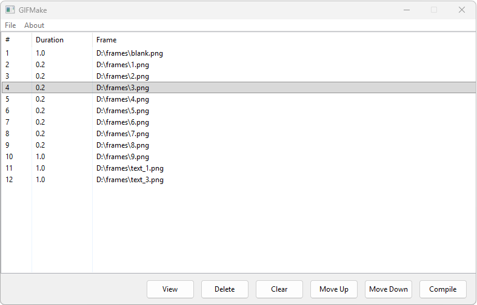

Gifmake
=======

Gifmake is a simple software program which can preload a set of image frames, allow modification of each frames' duration and finally compile an animation gif image from these frames. Particularly simple and useful for the preparation of carefully prepared adverts and classical old school banners.

Why?
====

Quick google search produced a magnitude of online web tools which permit the creation of gif images albeit overly complex and don't allow the careful modification of frame duration nor the simple use case of a simple load and compile.

License
=======

GPL v2... if you improve upon it please provide a copy back, thank you.
